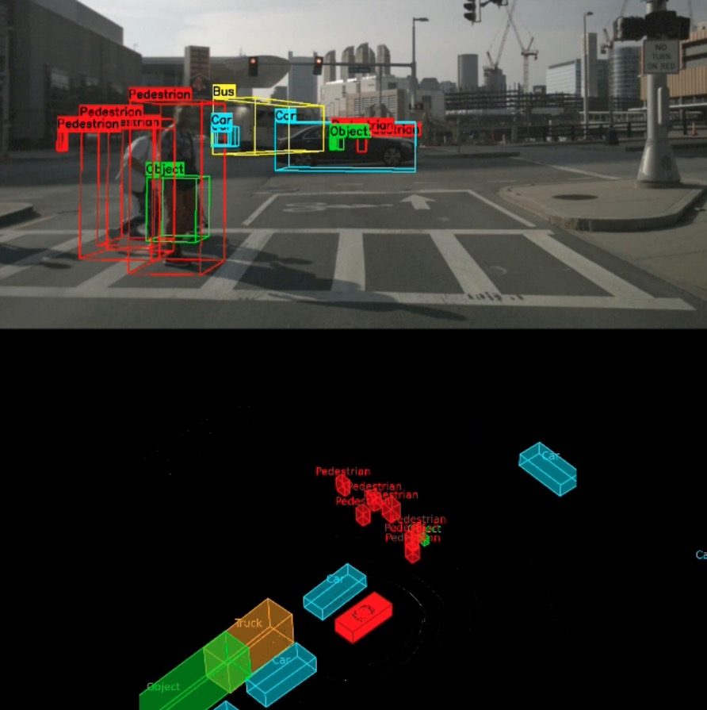

# Self-Driving Perception System

A phased exploration of autonomous driving perception, evolving from 2D multi-view object detection to SOTA 3D LiDAR-based perception using the **nuScenes** dataset.

## Project Overview

- **Objective:** Build a perception stack that processes multi-modal sensor data (Camera + LiDAR) for autonomous driving.
- **Dataset:** mini-nuScenes v1.0-mini (6 Cameras, 1 LiDAR, Radar).
- **Models:** PointPillars (3D LiDAR Detection via MMDetection3D)
- **Output:** Visualization videos demonstrating 2D & 3D situational awareness.



## Features

- **Composite Visualization**: Synchronized view of Front Camera (Top) and LiDAR Point Cloud (Bottom).
- **3D Object Rendering**: Solid, semi-transparent 3D bounding boxes in LiDAR view.
- **Class-Specific Styling**: Color-coded objects (Cyan=Car, Red=Pedestrian, Orange=Truck) with text labels.
- **Sensor Fusion**: 3D bounding boxes projected onto the 2D camera image.
- **Point Cloud Features**: LiDAR points colored by intensity to reveal road markings.
- **Ego Vehicle**: Visualization of the ego car's position and orientation.

## Quick Start

### 1. Setup Environment

#### Option A — Phase 1 Environment (Local)

Suitable for running `video_demo.py` and `demo_3d_dual_viz.py`.

```bash
# Create virtual environment
python3 -m venv venv
source venv/bin/activate

# Install dependencies
pip install -r requirements.txt
```

#### Option B — Phase 2 Environment (GPU / Linux / Colab)

Required for running `demo_phase2_lidar.py`.

MMDetection3D is difficult to compile on macOS — it is recommended to use **Google Colab**, **Linux**, or any machine with **NVIDIA GPU support**.

---

### 2. Download Dataset

Download **mini-nuScenes v1.0-mini (~4GB)** from:  
https://www.nuscenes.org/download

Choose:  
**Full dataset (v1.0) → mini → `v1.0-mini.tgz`**

Extract to:
./data/nuscenes/

Verify that this path exists:
./data/nuscenes/v1.0-mini/maps

---

## 3. Run Demos

Generates a composite video with solid 3D boxes, class labels, and intensity rendering.

```bash
source venv/bin/activate
python3 viz_3d_video.py
Output: output/lidar_3d_viz_composite.mp4
```

## Project Structure

```
self_driving_perception/
├── viz_3d_video.py             # [Phase 2] Custom 3D LiDAR Visualizer (Main)
├── video_demo.py               # [Phase 1] Dual-View 2D Detection (YOLO)
├── demo_3d_dual_viz.py         # [Phase 2] Legacy 3D GT Visualization
├── demo_phase2_lidar.py        # [Phase 2] LiDAR Inference (PointPillars)
├── data/
│   ├── nuscenes_loader.py      # Enhanced loader: Camera + LiDAR + Calibration
│   └── nuscenes/v1.0-mini/     # Dataset location
├── models/
│   └── weights/                # Model weights (.pth) + configs (.py)
├── output/                     # Generated demo videos
├── requirements.txt            # Python dependencies for Phase 1
└── README.md                   # This file
```

## Technical Details

### Phase 1: 2D Pipeline

- **Inputs:** Synchronized `CAM_FRONT` and `CAM_BACK` images
- **Detection:** YOLOv8n (runs per frame)
- **Fusion:** Vertical concatenation using `cv2.vconcat` for a split-screen dashboard
- **Depth Estimation:** Heuristic estimation using bounding-box height and pinhole camera geometry

---

### Phase 2: 3D Pipeline

**Coordinate Transformation:**
LiDAR Frame (x, y, z) → Ego Frame → Camera Frame → Image Plane (u, v)

**Projection:**  
3D cuboid corners projected into 2D using the camera intrinsic matrix.

**Data Fusion:**  
Overlay LiDAR-derived spatial data (3D boxes, orientation, coordinates) onto camera RGB frames.

---

## Dependencies

### Core

- Python 3.8+
- PyTorch
- OpenCV (`cv2`)
- NumPy
- nuscenes-devkit
- ultralytics (YOLOv8)

### Optional (Phase 2)

- MMDetection3D
- MMCV
- CUDA Toolkit (for GPU acceleration)

---

## Troubleshooting

- **"Dataset not found":**  
  Ensure the directory exists:

data/nuscenes/v1.0-mini/

- **"Video format not supported" on macOS:**  
  Videos use H.264 (`avc1`). Try **VLC** if default macOS apps fail.

- **"No module named mmdet3d":**  
  You are running a Phase 2 script without an MMDetection3D environment.  
  Use **Google Colab** or a **Linux GPU machine**.

---

## License

MIT License — Educational project for autonomous driving perception.
